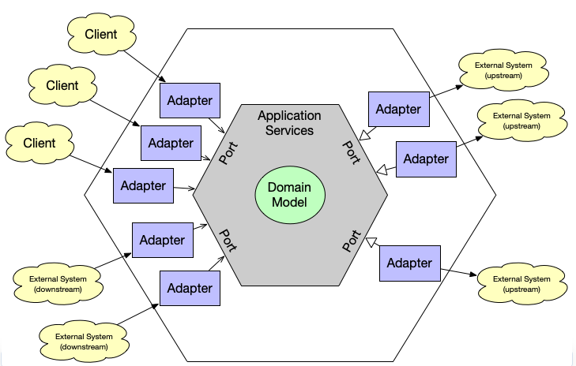

- Arquitetura Hexagonal
    - O que é arquitetura hexagonal?

        Documentado em 2005 por Alistair Cockburn, arquitetura Hexagonal é uma arquitetura de software que tem muitas vantagens e teve seu interesse renovado desde 2015

    - Porque utilizar?

        Pertimitir que uma aplicação seja igualmente conduzida por usuários, programas, testes automatizados ou batch scripts e ser desenvolvida e testada isoladamente dos seus eventuais dispositivos runtime e banco de dados 

    - Retrato da arquitetura

        

        - Camada Domain:
            - Razão do software existir
            - Entidades
            - Regras de negócio
        - Camada Aplicação:
            - Casos de uso
            - Fluxo da aplicação
        - Camada framework (adapters)
            - Serialização
            - HTTP
            - Processo de visualização
    - Principal motivo para utilizar

        Isolar o nucleo da aplicação (Dominio e aplicação), tendo o menor acoplamento possivel das demais partes do sistema

    - Como o núcleo da aplicação se comunica com as outras partes?
        - Através de Portas (Interfaces em java) e adaptadores, que são implementações dessas porta

        - Adaptadores ficam fora do core e portas ficam dentro do core
        - Comunicação Inbound
            - Quando uma ação é requisitada de fora do núcleo
            - Exemplo: Alguma requisição de navegador
        - Comunicação Outbound
            - Quando a ação é requisitada pelo núcleo
            - Exemplo: Persistir dados no banco
    - Diferença entre arquitetura em camadas tradicional e arquitetura hexagonal
        - Na arquitetura hexagonal não há acoplamento entre o core e a infraestrutura (camadas externas ao core)

    - Pros
        - Facilidade de criação de testes unitários
        - Independe de frameworks e tecnologias de curto contrato
        - Baixíssimo/Nulo acoplamento no core da aplicação
        - Facilidade em trocar a infraestrutura (Banco de dados por exemplo)
    - Contras
        - Complexidade adicional
        - Não há orientação de como organizar o código

Fontes:

[ARQUITETURA HEXAGONAL EM MICROSERVICES](https://www.youtube.com/watch?v=UmdOjbyYOX0) - Michelli Brito